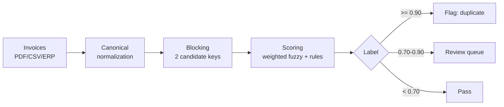

# invoice-dedupe

Duplicate invoice detection to prevent **double payments** — catching invoices that look
different (different numbers, formatting, vendor name variants) but are really the same
transaction.

Manual review by AP staff routinely misses subtle duplicates. This project detects them
automatically through layered canonical normalization, weighted fuzzy matching, O(N²)-free
blocking, and contextual rules — with a review queue for the gray zone.

> **New here (human or AI agent)?** Read [`AGENTS.md`](AGENTS.md) first, then
> [`docs/PROJECT_CHARTER.md`](docs/PROJECT_CHARTER.md) (goals, agreed decisions, roadmap)
> and [`docs/DESIGN.md`](docs/DESIGN.md) (architecture, algorithms, decision log).
> Development must rely on those documents, not on any chat history.

## Results (synthetic dataset: 10,200 invoices, 200 duplicates, seed 42)

| Metric | Value |
|---|---|
| Precision @ flag (0.90) | **0.9852** (3 FP) |
| Recall @ flag | **1.0000** (200/200) |
| F1 | **0.9926** |
| Blocking reduction | 52,014,900 → 4,525 comparisons (**99.99%**) |
| Detection time | ~1.3 s, single process |
| Duplicate value caught | **$7.36M** |

Re-verified unchanged after Phase 2 (service/ingestion layer added; detection engine
untouched) and after Phase 3 (web app added; detection engine untouched). The same
numbers render live in the web app dashboard after
`invoice-dedupe seed-demo --n 10000 --seed 42` (measured precision @ 0.90: 0.9852,
recall 1.0000, 203 flagged pairs, $7.37M exposure).

Recall per duplicate variant (all 100%): `format`, `confusion`, `vendor_variant`,
`reinvoice` (vendor resubmits with a brand-new number — the hardest and most expensive
class), `date_shift`.

**The 3 false positives** share one pattern: identical vendor + identical amount +
≤14 days apart + different numbers, flagged by the re-invoice rule. That is healthy
precision: such a pair genuinely deserves human scrutiny in the real world (monthly
billing that happens to land close together vs. an actual resubmission). Planned
mitigations: suppressing recurring-billing collisions with the `billing_period` key and
a feedback loop from review decisions (Phase 4; the API already persists decisions).

## How it works



**Layer 1 — canonical normalization** (~70% of the win). Invoice numbers are stripped of
separators, uppercased, and look-alike characters are mapped only when adjacent to a digit
(`INV-O78L` ≡ `INV-0781`, while the `INV` prefix stays intact). Vendor names lose their
legal entity form (`Ltd`, `GmbH`, `PT`, `Tbk`, `B.V.`, ...) across jurisdictions. Amounts
support both international (1,250,000.00) and Indonesian/European (1.250.000,00) formats.

**Layer 2 — weighted fuzzy scoring.** Per-field similarity combined by weights: invoice
number 0.35, vendor 0.25, amount 0.30, date 0.10. Unequal invoice numbers are discounted
(factor 0.7): sequential numbers (`...0001` vs `...0002`) are near-identical
character-wise yet usually distinct transactions — strong evidence must come from amount
and vendor instead.

**Layer 3 — contextual rule.** The re-invoice pattern: exact same vendor + exact same
amount + different number + ≤14 days apart lifts the score to a floor of 0.92 (flag).
This catches the most expensive duplicate class that humans miss most often.

**Hard rule.** Differing tax IDs cap the score at 0.55 — different legal entities are
almost never duplicates.

**Blocking.** Only pairs sharing a `(vendor_key, invoice_no_norm)` or `(amount)` key are
compared, keeping complexity far below O(N²). Degenerate blocks (>1000 members) are
skipped as a safety valve.

## Quickstart

```bash
python3 -m venv .venv && .venv/bin/pip install -e ".[dev]"

# end-to-end demo: generate 10k invoices -> detect -> evaluate
invoice-dedupe demo --n 10000 --seed 42

# or step by step
invoice-dedupe generate --n 10000 --seed 42 --out datasets
invoice-dedupe run --dataset datasets/invoices.jsonl --out datasets/pairs.jsonl
invoice-dedupe evaluate --dataset datasets/invoices.jsonl --pairs datasets/pairs.jsonl

pytest
```

### Service mode (Phase 2) and web app (Phase 3)

```bash
# 1. PostgreSQL (any instance works; default DSN below, override with DEDUPE_DATABASE_URL)
docker run -d --name invoice-dedupe-postgres \
  -e POSTGRES_USER=invoice_dedupe -e POSTGRES_PASSWORD=invoice_dedupe \
  -e POSTGRES_DB=invoice_dedupe -p 127.0.0.1:5433:5432 postgres:16-alpine

# 2. schema, demo data, API, worker
invoice-dedupe init-db
invoice-dedupe seed-demo --n 10000 --seed 42   # synthetic dataset + ground truth, runs detection
invoice-dedupe serve --port 8000        # terminal 1 — then open http://127.0.0.1:8000
invoice-dedupe worker                   # terminal 2

# 3. upload a text-layer PDF; the worker extracts + detects asynchronously
invoice-dedupe make-pdf --out sample.pdf
curl -F "file=@sample.pdf;type=application/pdf" http://127.0.0.1:8000/invoices/pdf
curl http://127.0.0.1:8000/pairs?label=flag
```

The web app (served at `/`, fully offline — assets vendored, no CDN):

- **Dashboard** — flag-threshold slider with live flagged count, precision and
  recall (measured against the seeded ground truth, or estimated from your review
  decisions when no ground truth is loaded), double-payment exposure, threshold
  curves, and the pair score histogram.
- **Review queue** — side-by-side pair comparisons with the per-field score
  breakdown (invoice no / vendor / amount / date, tax-ID and rule chips).
  Keyboard triage: `j`/`k` navigate, `d` = duplicate, `n` = not a duplicate;
  every verdict is persisted and the cursor auto-advances, so 100 flagged pairs
  take minutes.
- **Invoices** — paginated list with extraction confidence and duplicate-variant
  badges. **Upload** — drag & drop PDFs with live job progress.

API: `GET /` (web app) · `GET /health` · `POST /invoices/pdf` · `GET /jobs/{id}` ·
`GET /invoices` · `GET /invoices/{id}` · `GET /pairs?label=flag|review|pass&undecided=`
(enriched with both invoices + decision) · `POST /pairs/{a}/{b}/decision` ·
`GET /metrics?flag_threshold=` (dashboard payload). Raw extraction text is stored
per invoice (`GET /invoices/{id}`) separately from the parsed fields.

## Layout

```
src/invoice_dedupe/
  normalize.py   per-field canonicalization (number, vendor, amount, tax ID, period)
  scoring.py     fuzzy similarity, weights, re-invoice & tax-ID rules, thresholds
  blocking.py    candidate generation without O(N^2)
  engine.py      pipeline: normalize -> block -> score -> label
  synth.py       synthetic dataset generator + 5 duplicate variant classes (ground truth)
  evaluate.py    precision/recall/F1, threshold sweep, per-variant recall
  dataset.py     JSONL I/O
  cli.py         generate / run / evaluate / demo / init-db / seed-demo / serve / worker / make-pdf
  extraction.py  pdfplumber text-layer extraction + label-based field parser
  pdfgen.py      dependency-free text-layer PDF writer (demo/test fixtures)
  db.py          PostgreSQL persistence (invoices, pairs, review decisions, jobs)
  metrics.py     dashboard threshold metrics (measured + decision-based precision)
  worker.py      job queue consumer (extraction + detection)
  api.py         FastAPI service + web app hosting
  webapp/        React review app (vendored UMD builds, no build step, offline)
```

## Roadmap

- ~~**Phase 2**: FastAPI service + PDF ingestion (pdfplumber) + PostgreSQL + worker queue~~ (done)
- ~~**Phase 3**: Interactive review-queue web app with per-field score breakdown~~ (done)
- **Phase 4**: Vision-LLM extraction fallback for scans/photos + feedback loop
  (threshold tuning and weight adjustment from reviewer decisions)

Acceptance criteria per phase: see [`docs/PROJECT_CHARTER.md`](docs/PROJECT_CHARTER.md).

## Honest limitations

- Evaluation uses synthetic data; real-world duplicates are messier (OCR noise, currency
  differences, credit notes).
- Legitimate recurring invoices (monthly subscriptions) are deliberately planted in the
  dataset as *hard negatives*. Currently some land in the review queue rather than being
  flagged; handling them fully requires the `billing_period` key and the feedback loop
  (Phase 4).
- Thresholds (0.90/0.70) are hand-set for now; labeled review decisions will replace them.
- PDF ingestion covers **text-layer** documents with labeled fields (pdfplumber);
  unlabeled layouts and scans/photos need the Phase 4 vision-LLM fallback. Every
  invoice reports its extraction confidence and missing fields.
